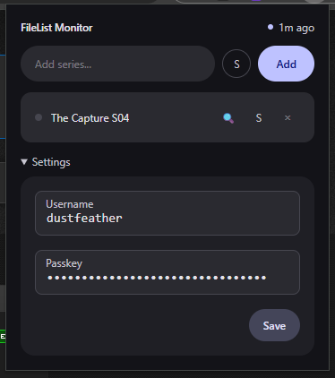

# FileList Monitor

Browser extension (Chrome & Firefox) that tracks TV series on [filelist.io](https://filelist.io) and sends desktop notifications when new torrents appear.



## How it works

1. Add series names you want to track (e.g. "Snowpiercer S04")
2. The extension searches the filelist.io API for each series on a configurable interval
3. New matches trigger a browser notification with the torrent title
4. Series with no new results for 30 days are automatically removed

**Strict mode**: Toggle per series to match only full season packs, excluding individual episodes.

Credentials (username + passkey) are auto-discovered from your active filelist.io session, or can be entered manually in settings.

## Install

### From GitHub Releases

Download the latest release:
- **Chrome**: `.zip` file → go to `chrome://extensions`, enable Developer Mode, drag & drop the zip
- **Firefox**: `.xpi` file → go to `about:addons`, install from file

### Build from source

```bash
pnpm install
pnpm run build
```

Then load the `dist/` directory as an unpacked extension (Chrome) or temporary add-on (Firefox).

## Configuration

| Setting | Default | Description |
|---------|---------|-------------|
| Poll interval | 10 min | How often to check for new torrents (5–60 min). Auto-raised if needed: `max(userInterval, ceil(seriesCount × 60 / 150))` to stay under the 150 req/hr API limit |
| Username | Auto-detected | Your filelist.io username |
| Passkey | Auto-detected | Your filelist.io passkey |

## Development

```bash
pnpm run dev    # Vite dev server with HMR
pnpm run build  # Production build
```

## License

MIT