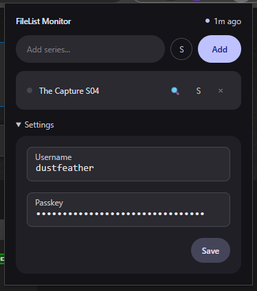

# FileList Monitor

Browser extension (Chrome & Firefox) that tracks TV series on [filelist.io](https://filelist.io) and sends desktop notifications when new torrents appear.



## How it works

1. Add series names you want to track (e.g. "Snowpiercer S04")
2. The extension searches the filelist.io API for each series on a configurable interval
3. New matches trigger a browser notification with the torrent title
4. Series with no new results for 30 days are automatically removed

**Strict mode**: Toggle per series to match only full season packs, excluding individual episodes.

Credentials (username + passkey) are auto-discovered from your active filelist.io session, or can be entered manually in settings.

## Install

### Chrome

[Install from the Chrome Web Store](https://chromewebstore.google.com/detail/filelist-monitor/fkklofnmhjhifmnkhgjplkkkpjoajdhj)

### Firefox

[Install from Firefox Add-ons](https://addons.mozilla.org/en-US/firefox/addon/filelist-monitor/)

### Build from source

Requires [Node.js](https://nodejs.org/) >= 22 and [pnpm](https://pnpm.io/) >= 9. Works on Linux, macOS, and Windows.

```bash
pnpm install
pnpm run build
```

The built extension is in the `dist/` directory. Load it as an unpacked extension in Chrome or temporary add-on in Firefox.

## Configuration

| Setting | Default | Description |
|---------|---------|-------------|
| Poll interval | 10 min | How often to check for new torrents (5–60 min). Auto-raised if needed: `max(userInterval, ceil(seriesCount × 60 / 150))` to stay under the 150 req/hr API limit |
| Username | Auto-detected | Your filelist.io username |
| Passkey | Auto-detected | Your filelist.io passkey |

## Development

```bash
pnpm run dev    # Vite dev server with HMR
pnpm run build  # Production build
```

## License

[GPL-3.0](LICENSE)